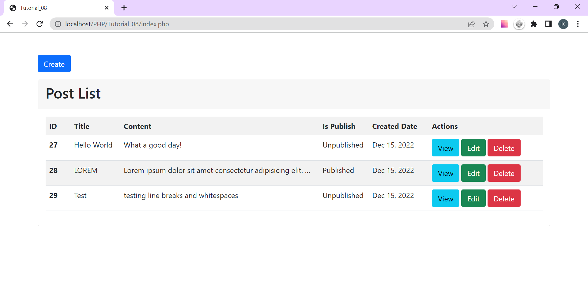
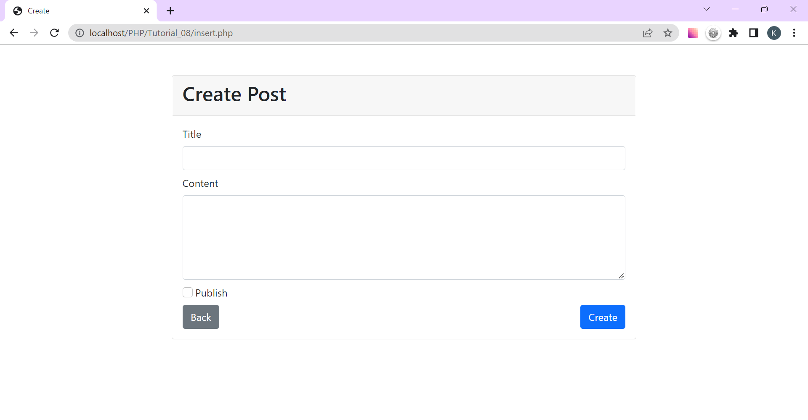
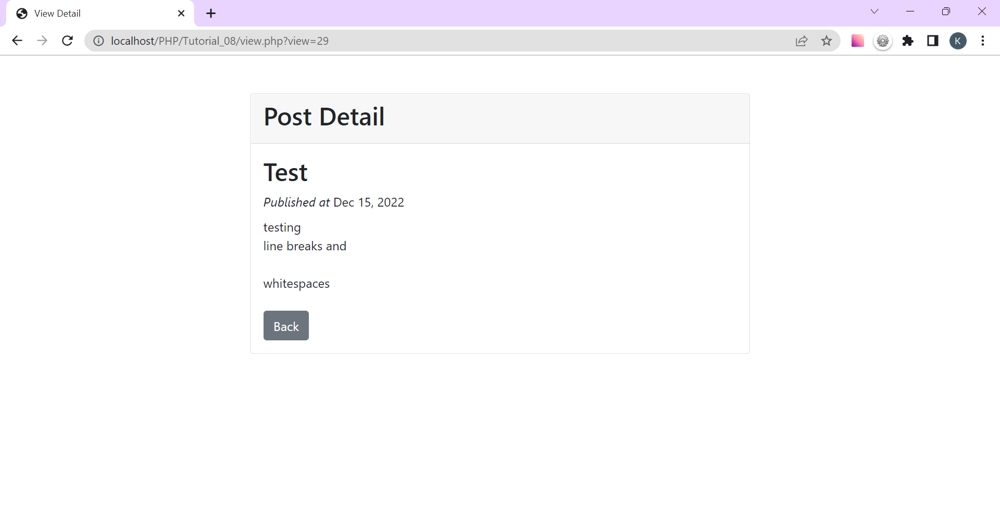
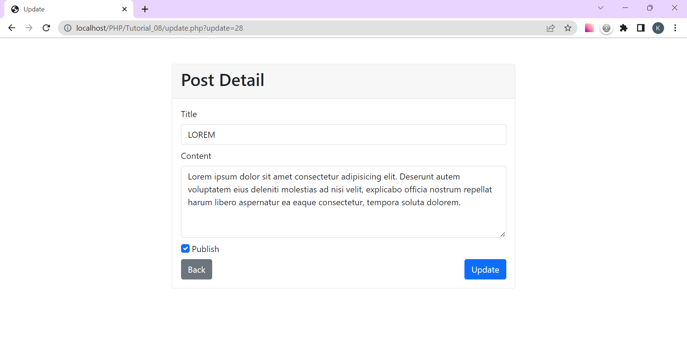
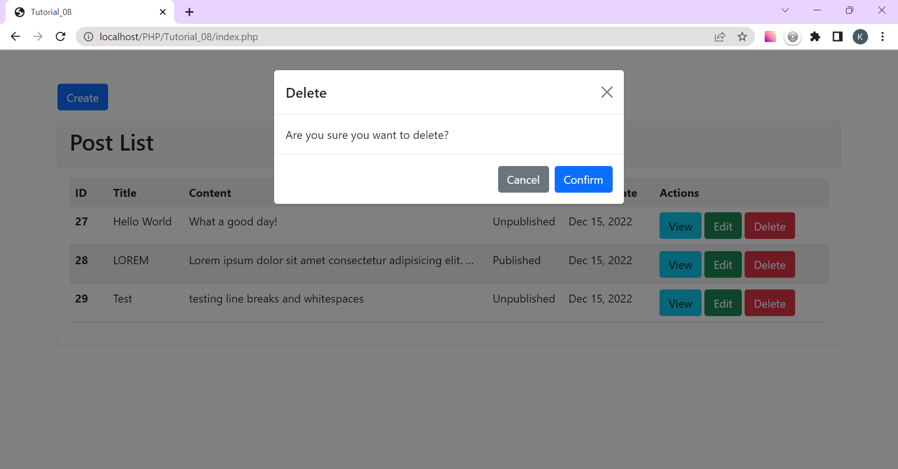

<h1>Tutorial_08 CRUD</h1>

<h2>Instructions</h2>
<ol>
<li>If "batch_6" database and "posts" table already existed, run index.php.</li>
<li>If not, run create.php to create database and table.</li>
<li>Database connection is established in db.php</li>
</ol>

<h2>Sample</h2>

Index Page

  

Create Post Page

  

View Detail Page

  

Edit Post Page

  

Delete Alert

